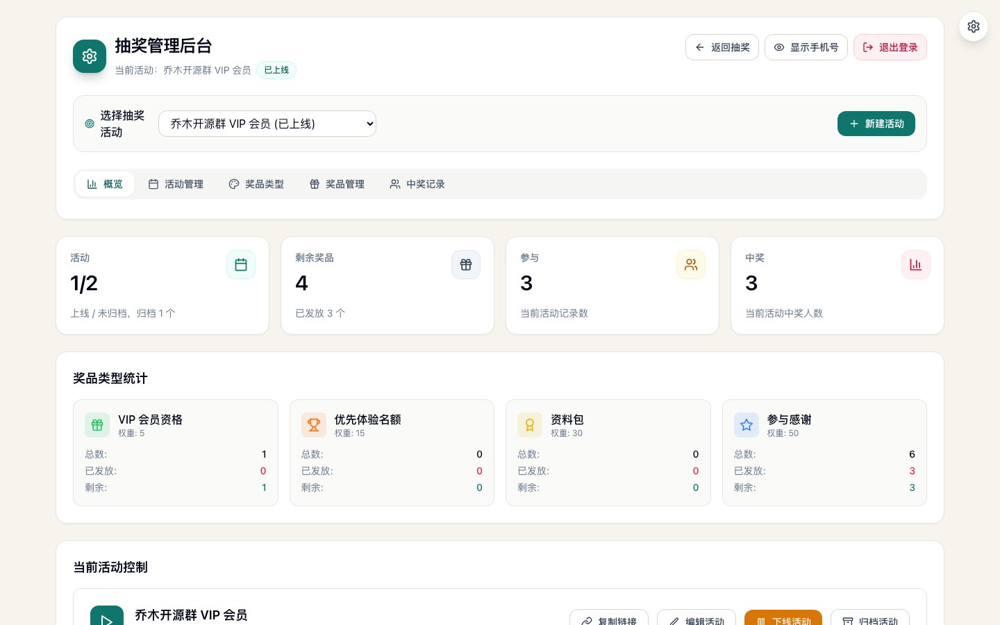
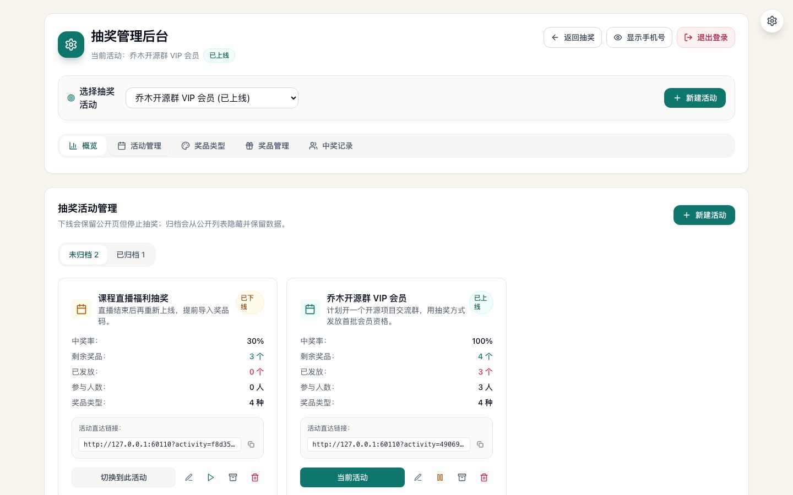
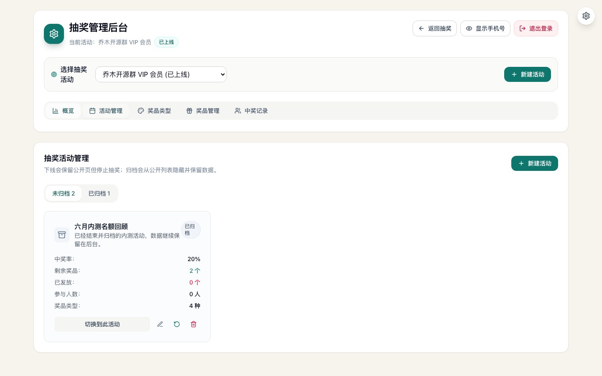
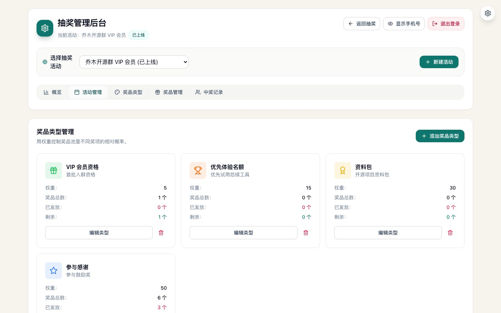
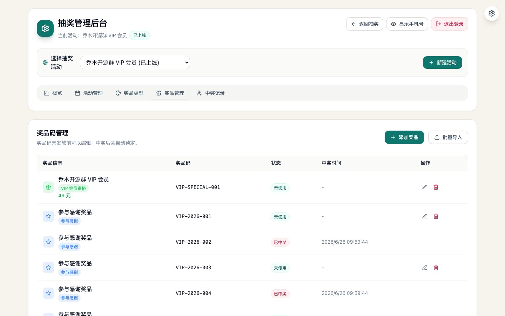
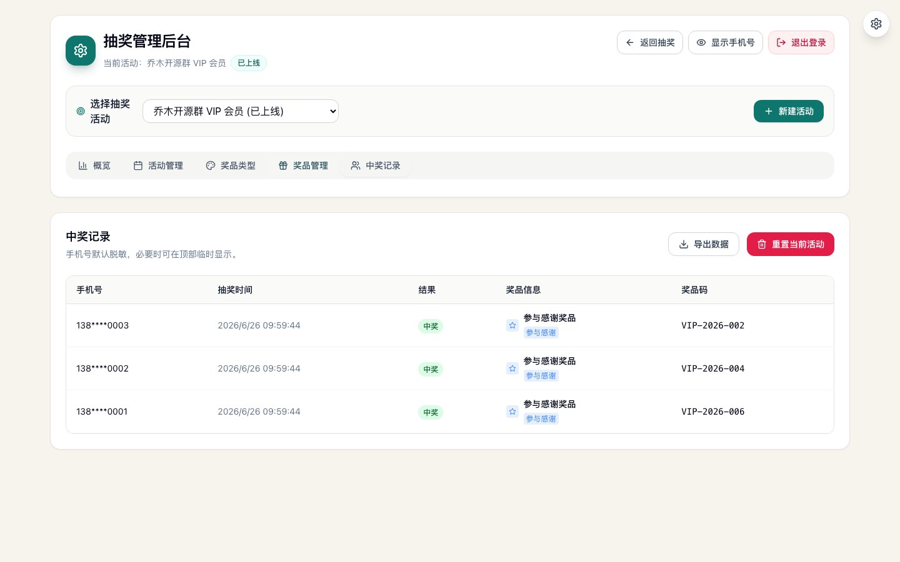
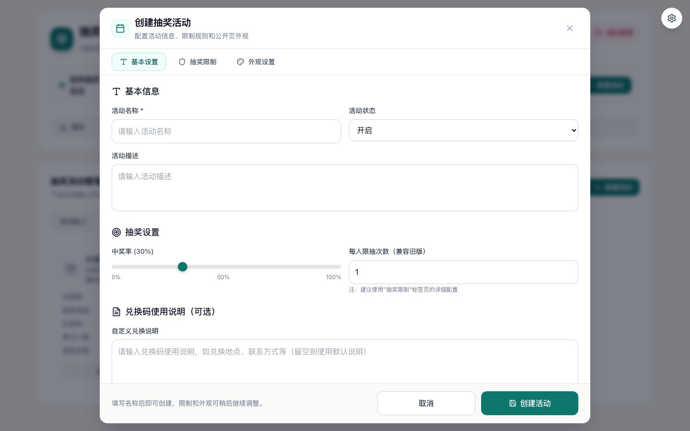

# Qiaomu Lucky

**中文** | [English](#english)



> 乔木日常抽奖是一个开源自托管的活动抽奖和奖品码发放工具，适合日常社群、活动、课程、直播、内测名额和优惠码发放。
>
> Qiaomu Lucky is a self-hosted daily lottery and prize-code distribution tool for communities, campaigns, courses, live events, beta invites, and voucher delivery.

[在线演示](https://lucky.qiaomu.ai/) · [快速开始](#快速开始) · [部署指南](docs/deployment.md) · [安全说明](docs/privacy-security.md) · [MIT License](LICENSE)

[](https://github.com/joeseesun/qiaomu-lucky/actions/workflows/ci.yml)
[](LICENSE)

**已验证:** `npm run check` 会执行 ESLint 和生产构建。线上演示运行在 `lucky.qiaomu.ai`，数据由自托管 Node 服务写入本机 JSON 文件。

## 这是什么

Qiaomu Lucky 把一次小型活动抽奖需要的几件事放在一个轻量工具里：活动配置、中奖率、抽奖限制、奖品码导入、中奖记录、中奖查询、分享链接和管理员后台。它不需要外部数据库，默认用 Node.js 服务和本机 JSON 文件保存数据，适合一台 VPS、内网服务器或小型自托管环境。

它不是博彩、彩票代理或合规抽签服务。正式商业活动、监管场景、奖品价值较高的营销活动，请自行确认当地法律、隐私和活动规则要求。

## 为什么值得用

| 场景 | 你得到什么 |
| --- | --- |
| 社群福利抽奖 | 快速创建活动，导入兑换码，复制公开链接发给参与者 |
| 课程/直播福利 | 限制每个手机号参与次数，中奖后显示兑奖码和说明 |
| 内测名额发放 | 把邀请码、激活码、优惠码作为奖品码管理 |
| 运营复盘 | 后台查看中奖记录、中奖率、剩余奖品和导出记录 |
| 自托管部署 | 数据留在自己的服务器，管理员密码和 session secret 由自己配置 |

## 核心能力

- 多活动管理：创建、编辑、下线、重新上线、归档、恢复归档和删除不同抽奖活动。
- 奖品类型：为不同奖项配置并编辑名称、颜色、权重和说明；权重会同步到关联奖品码。
- 奖品码管理：批量导入奖品码，中奖后自动标记为已发放；手动配置的奖品名会被保留。
- 抽奖限制：支持手机号、IP、冷却时间和组合限制。
- 中奖查询：用户可以通过手机号查询中奖结果。
- 管理后台：统计卡、活动状态控制、奖品类型、奖品码列表、中奖记录和导出记录。
- 一次性密码重置：服务器本机或后台生成限时链接，重置管理员密码。
- 自托管数据：默认写入 `data/lottery-data.json` 和 `data/runtime-secrets.json`。

## 后台功能巡游

下面截图使用本地临时演示数据生成，不包含线上真实手机号或兑奖码。

### 概览与当前活动控制

统计当前活动的剩余奖品、参与人数、中奖人数和各奖项发放情况；活动控制区可以复制公开链接、编辑活动、下线活动或归档活动。


### 活动管理、下线和归档

未归档活动用于日常运营；下线活动仍保留公开页但停止抽奖；归档活动从公开列表隐藏，后台继续保留奖品码和中奖记录。





### 奖品类型

每个活动都有自己的奖品类型。可以编辑奖项名称、描述、图标、颜色和权重；修改权重会同步到关联奖品码，修改名称时只同步批量导入自动生成的奖品名，手动配置的奖品名不会被覆盖。



### 奖品码与中奖记录

奖品码可以批量导入或单条维护，中奖后自动标记为已发放；中奖记录用于运营复盘、兑奖核对和导出备份。





### 创建活动弹窗

活动创建弹窗把基础信息、抽奖限制和公开页外观分成三个标签页，长表单使用内部滚动，底部操作按钮固定可见。



## 快速开始

### 最快路径

```bash
git clone https://github.com/joeseesun/qiaomu-lucky.git
cd qiaomu-lucky
npm ci
cp .env.example .env
```

编辑 `.env`，至少修改：

```bash
LUCKY_ADMIN_PASSWORD=change-me-to-a-long-admin-password
LUCKY_SESSION_SECRET=change-me-to-a-random-string-at-least-32-chars
LUCKY_PUBLIC_BASE_URL=http://127.0.0.1:3158
```

启动：

```bash
npm run build
npm start
```

打开：

- 抽奖页面: `http://127.0.0.1:3158/`
- 管理后台: `http://127.0.0.1:3158/admin`
- 健康检查: `http://127.0.0.1:3158/api/health`

### 开发模式

```bash
npm ci
cp .env.example .env
npm run server
```

另开一个终端：

```bash
npm run dev
```

Vite 开发服务器会把 `/api` 代理到 `http://127.0.0.1:3158`。

## 配置

| 变量 | 必填 | 说明 |
| --- | --- | --- |
| `LUCKY_ADMIN_PASSWORD` | 是 | 管理后台初始密码，至少 10 个字符 |
| `LUCKY_SESSION_SECRET` | 是 | session 签名密钥，至少 16 个字符，建议 32 字符以上 |
| `LUCKY_PUBLIC_BASE_URL` | 建议 | 生成分享链接和密码重置链接时使用的公开地址 |
| `HOST` | 否 | 服务监听地址，默认 `127.0.0.1` |
| `PORT` | 否 | 服务端口，默认 `3158` |
| `LUCKY_DATA_DIR` | 否 | 数据目录，默认 `./data` |
| `LUCKY_STATIC_DIR` | 否 | 静态文件目录，默认 `./dist` |
| `VITE_UMAMI_SCRIPT_URL` | 否 | Umami 统计脚本地址，留空即关闭 |
| `VITE_UMAMI_WEBSITE_ID` | 否 | Umami website id |
| `VITE_UMAMI_DOMAINS` | 否 | Umami 限定统计域名 |

生成随机 session secret：

```bash
node -e "console.log(require('node:crypto').randomBytes(32).toString('base64url'))"
```

## 部署

推荐部署形态是：

```text
Browser -> Nginx/Caddy HTTPS reverse proxy -> Node.js service on 127.0.0.1:3158
```

完整 systemd 和 Nginx 示例见 [docs/deployment.md](docs/deployment.md)。

## 数据与安全边界

- 本项目默认不连接外部数据库。
- 抽奖数据、手机号、中奖记录和奖品码保存在本机 JSON 文件中。
- 管理员密码重置后的运行时 secret 保存在 `data/runtime-secrets.json`，请确保该目录不被公开访问。
- `.env`、`data/`、构建产物和日志不会进入 git。
- 公开部署时必须放在 HTTPS 后面，并设置强密码。

更多说明见 [docs/privacy-security.md](docs/privacy-security.md) 和 [SECURITY.md](SECURITY.md)。

## 项目结构

```text
.
├── server.mjs              # Node HTTP server, API, static file serving
├── src/                    # React frontend
├── public/                 # Static assets, icon, optional Qiaomu support QR assets
├── docs/                   # Deployment, security, screenshots
├── .github/                # CI and contribution templates
└── data/                   # Runtime data, ignored by git
```

## 乔木默认入口

公开演示站点包含「打赏支持」「公众号二维码」「乔木推荐」等 Qiaomu 个人品牌入口。自托管时可以：

- 替换 `public/qiaomu_reward_qr.png` 和 `public/qiaomu_wechat_public_account_qr.jpg`；
- 修改 `src/components/SiteAffordances.tsx` 中的链接和文案；
- 或移除该组件，改成自己的站点入口。

## 贡献

欢迎提交 bug report、部署问题、交互优化建议和文档改进。请先阅读 [CONTRIBUTING.md](CONTRIBUTING.md)。安全问题请不要公开发 issue，按 [SECURITY.md](SECURITY.md) 联系。

## 关于向阳乔木

向阳乔木，本名乔向阳，是一位把 AI 前沿变化转译成产品判断、可执行工作流、AI coding 实践和 GEO/AI 营销方法论的中文 AI 创作者。

- 个人站: <https://qiaomu.ai>
- 博客: <https://blog.qiaomu.ai>
- 乔木推荐: <https://tuijian.qiaomu.ai>
- X: <https://x.com/vista8>
- GitHub: <https://github.com/joeseesun/>
- 微信公众号: 向阳乔木推荐看

## License

[MIT](LICENSE)

---

<a name="english"></a>

# English

Qiaomu Lucky is a self-hosted lottery and prize-code delivery app for small campaigns, community rewards, live events, courses, beta invites, and voucher distribution.

It includes an admin dashboard, activity settings, weighted prize types, prize-code import, draw restrictions, winner lookup, exportable records, and one-time admin password reset links. By default, it runs as a Node.js server and stores data in local JSON files, so you can deploy it on a small VPS without an external database.

## Admin Tour

The Chinese section above includes current screenshots of the admin surfaces:

- Overview and activity control: metrics, public link copy, offline/online, archive.
- Activity management: active, offline, and archived activity views.
- Prize types: per-activity prize categories with editable names, colors, icons, and weights.
- Prize codes: imported or manually maintained prize-code inventory.
- Records: winner history for redemption checks and operations review.
- Activity modal: basic settings, draw restrictions, and public-page appearance in one dialog.

## Quick Start

```bash
git clone https://github.com/joeseesun/qiaomu-lucky.git
cd qiaomu-lucky
npm ci
cp .env.example .env
```

Edit `.env`:

```bash
LUCKY_ADMIN_PASSWORD=change-me-to-a-long-admin-password
LUCKY_SESSION_SECRET=change-me-to-a-random-string-at-least-32-chars
LUCKY_PUBLIC_BASE_URL=http://127.0.0.1:3158
```

Run:

```bash
npm run build
npm start
```

Open:

- Public page: `http://127.0.0.1:3158/`
- Admin dashboard: `http://127.0.0.1:3158/admin`
- Health check: `http://127.0.0.1:3158/api/health`

## Important Boundaries

- This is not a gambling, regulated lottery, or legal compliance product.
- You are responsible for your campaign rules, privacy notice, and local regulations.
- Phone numbers, prize codes, draw records, and runtime secrets are stored locally under `data/` by default.
- Use HTTPS, a strong admin password, and regular backups for public deployments.

See [docs/deployment.md](docs/deployment.md), [docs/privacy-security.md](docs/privacy-security.md), and [SECURITY.md](SECURITY.md) for more details.
